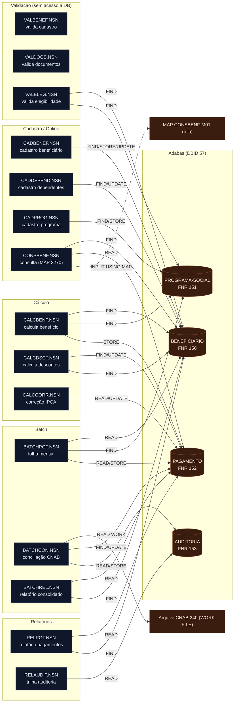

<!-- markdownlint-disable MD013 MD025 MD026 MD028 MD029 MD034 MD040 MD051 MD060 -->

# Mapa de Dependências — SIFAP Legado

  

> 🗺 **Você está aqui:** [Kit PT-BR](../README.md) → [Estágio 1](README.md) → **dependency-map**

> **Para quem é isto?** Este é um **artefato preenchido pelo time** durante o Estágio 1 (Arqueologia).
>
> **O que você terá ao final do estágio:**
>
> 1. Este documento totalmente preenchido com os dados reais do legado SIFAP
> 2. Rastreabilidade para `01-arqueologia/legado-sifap/` (programas `.NSN` e DDMs)
> 3. Base de evidência usada nas EARS do Estágio 2 (`source_legacy:`)
>
> 📘 **Guia passo a passo:** [`GUIDE.md`](GUIDE.md).

> Use diagramas Mermaid para mapear as dependências entre programas Natural e DDMs Adabas.
> O objetivo é visualizar "quem chama quem" e "quem lê/escreve o quê".

> Gerado por `/map-dependencies` em **2026-06-10** · escopo `01-arqueologia/legado-sifap/natural-programs/` (recursivo) + leitura dos 4 DDMs. Todas as 15 unidades `.NSN` e os 4 DDMs foram lidos. Números de linha aproximados (±2).

## 🔴 Descoberta principal — NÃO HÁ acoplamento programa→programa

**Nenhum `CALLNAT`, nenhum `INCLUDE` e nenhum copycode foi encontrado em nenhum dos 15 programas.** Todos os relacionamentos entre programas que a documentação sugere (ex.: BATCHPGT "chama" CALCBENF/CALCDSCT) são, na prática, **lógica duplicada inline**. A arquitetura real é um conjunto de **15 programas independentes acoplados apenas pelos dados** (os 4 arquivos Adabas). O acoplamento é todo **program→data**, não program→program.

Consequência para a migração: não há um grafo de chamadas a preservar — há **regras duplicadas** a unificar (ver mistério de duplicação no [business-rules-catalog.md](business-rules-catalog.md)).

## Diagrama de Dependências (programa → dados)

> `VALBENEF` e `VALDOCS` não têm nenhuma operação Adabas (`FIND/READ/STORE/UPDATE`) — operam apenas sobre variáveis de input. São **subprogramas de validação puros**, mas **ninguém os chama via CALLNAT** (ver Órfãos).

## Arestas Programa → Programa

| Origem | Alvo | Tipo | Fonte | Linha |
| ------ | ---- | ---- | ----- | ----- |
| _(nenhuma)_ | — | CALLNAT | — | — |
| _(nenhuma)_ | — | INCLUDE | — | — |

**Nenhuma aresta programa→programa existe no código.** `PERFORM` aparece em vários programas, mas apenas para **sub-rotinas internas** (`DEFINE SUBROUTINE` no mesmo arquivo) — ver seção PERFORM.

## Arestas Programa → Dados

| Programa | DDM (FNR) | Operação | Fonte | Linha |
| -------- | --------- | -------- | ----- | ----- |
| CADBENEF | BENEFICIARIO (150) | FIND | `CADBENEF.NSN` | ~L136 |
| CADBENEF | BENEFICIARIO (150) | STORE | `CADBENEF.NSN` | ~L185 |
| CADBENEF | BENEFICIARIO (150) | UPDATE | `CADBENEF.NSN` | ~L210 |
| CADDEPEND | BENEFICIARIO (150) | FIND | `CADDEPEND.NSN` | ~L46 |
| CADDEPEND | BENEFICIARIO (150) | UPDATE | `CADDEPEND.NSN` | ~L115 |
| CADPROG | PROGRAMA-SOCIAL (151) | FIND | `CADPROG.NSN` | ~L84 |
| CADPROG | PROGRAMA-SOCIAL (151) | STORE | `CADPROG.NSN` | ~L106 |
| CONSBENF | BENEFICIARIO (150) | FIND | `CONSBENF.NSN` | ~L127 |
| CONSBENF | PAGAMENTO (152) | READ | `CONSBENF.NSN` | ~L200 |
| VALELEG | BENEFICIARIO (150) | FIND | `VALELEG.NSN` | ~L72 |
| VALELEG | PROGRAMA-SOCIAL (151) | FIND | `VALELEG.NSN` | ~L90 |
| CALCBENF | BENEFICIARIO (150) | FIND | `CALCBENF.NSN` | ~L150 |
| CALCBENF | PROGRAMA-SOCIAL (151) | FIND | `CALCBENF.NSN` | ~L169 |
| CALCBENF | PAGAMENTO (152) | STORE | `CALCBENF.NSN` | ~L282 |
| CALCDSCT | PAGAMENTO (152) | FIND | `CALCDSCT.NSN` | ~L74 |
| CALCDSCT | BENEFICIARIO (150) | FIND | `CALCDSCT.NSN` | ~L91 |
| CALCDSCT | PAGAMENTO (152) | UPDATE | `CALCDSCT.NSN` | ~L200 |
| CALCCORR | PAGAMENTO (152) | READ | `CALCCORR.NSN` | ~L155 |
| CALCCORR | PAGAMENTO (152) | UPDATE | `CALCCORR.NSN` | ~L190 |
| BATCHPGT | PAGAMENTO (152) | READ (BY NUM-PAGTO DESC) | `BATCHPGT.NSN` | ~L180 |
| BATCHPGT | BENEFICIARIO (150) | READ (BY CPF) | `BATCHPGT.NSN` | ~L197 |
| BATCHPGT | PAGAMENTO (152) | FIND | `BATCHPGT.NSN` | ~L221 |
| BATCHPGT | PROGRAMA-SOCIAL (151) | FIND | `BATCHPGT.NSN` | ~L231 |
| BATCHPGT | PAGAMENTO (152) | STORE | `BATCHPGT.NSN` | ~L345 |
| BATCHCON | AUDITORIA (153) | READ (BY SEQ DESC) | `BATCHCON.NSN` | ~L70 |
| BATCHCON | _CNAB 240_ | READ WORK FILE | `BATCHCON.NSN` | ~L100 |
| BATCHCON | PAGAMENTO (152) | FIND | `BATCHCON.NSN` | ~L158 |
| BATCHCON | PAGAMENTO (152) | UPDATE | `BATCHCON.NSN` | ~L195 |
| BATCHCON | AUDITORIA (153) | STORE | `BATCHCON.NSN` | ~L265 |
| BATCHREL | PAGAMENTO (152) | READ (BY COMPETENCIA) | `BATCHREL.NSN` | ~L110 |
| BATCHREL | BENEFICIARIO (150) | FIND | `BATCHREL.NSN` | ~L116 |
| RELPGT | PAGAMENTO (152) | READ (BY COMPETENCIA) | `RELPGT.NSN` | ~L88 |
| RELPGT | BENEFICIARIO (150) | FIND | `RELPGT.NSN` | ~L116 |
| RELAUDIT | AUDITORIA (153) | READ (BY DT-EVENTO) | `RELAUDIT.NSN` | ~L95 |

## Sub-rotinas internas (PERFORM)

Apenas chamadas intra-programa (`DEFINE SUBROUTINE`), não geram arestas no grafo:

| Programa | Sub-rotinas |
| -------- | ----------- |
| CALCBENF | DET-FAIXA-RENDA, CALC-DESCONTOS |
| CALCDSCT | CALC-CONTRIB-SOCIAL |
| VALELEG | VERIF-ELEG-ESPECIFICA |
| CADBENEF | VALIDA-CPF |
| VALBENEF | VALIDA-CPF-COMPLETO, VALIDA-DATA, VALIDA-NOME |
| VALDOCS | VALIDA-CPF-DOC, VALIDA-RG, CHECK-DOC-ESPECIAL |
| CADPROG | CONSULTA-PROG |
| CALCCORR | CALC-INDICE-ACUM |
| BATCHPGT | DET-FAIXA-RENDA-BATCH |
| BATCHCON | GRAVA-AUDITORIA-CONC, GRAVA-AUDITORIA-DIVERG |
| BATCHREL | IMPRIME-CABECALHO |
| RELPGT | IMPRIME-CABECALHO, IMPRIME-SUBTOTAL |
| RELAUDIT | IMPRIME-CAB-AUDIT |

## Referências quebradas / externas

| Origem | Referência | Tipo | Situação |
| ------ | ---------- | ---- | -------- |
| CONSBENF | `MAP 'CONSBENF-M01'` | INPUT USING MAP | **Ausente** — nenhum arquivo de MAP/tela no legado fornecido. Há fallback para INPUT texto. |
| BATCHCON | `RETORNO_REAL.DAT` (Banco Real) | WORK FILE | **Código morto** (comentado) — integração descontinuada em 2007. |
| BATCHCON | arquivo CNAB 240 (`#ARQ-RETORNO`) | WORK FILE externo | Entrada externa esperada em runtime (não é arquivo do repo). |
| _doc RN-010_ | `LOGAUDIT` (subprograma) | CALLNAT citado na doc | **Ausente** — não existe no legado; nenhum programa o chama. A auditoria real é gravada inline por BATCHCON. |

## Mapa de Dados (DDMs) — schema real vs. uso

> 🔴 **Os programas usam VIEWs MUITO reduzidas dos DDMs.** Cada DDM tem 34-52 campos; os programas leem ~10-15. Muitos campos do schema **nunca são lidos/escritos por nenhum programa do legado**.

| DDM | FNR | Campos (DDM) | Registros (2018) | Achados |
| --- | --- | ------------ | ---------------- | ------- |
| BENEFICIARIO | 150 | 52 | ~4,2 mi | Dependentes PE **máx 10** (CADDEPEND limita a 5; views de cálculo só liam 2). Tem NOME-MAE/PAI, biometria (2005), email/celular (2015) — não usados pelos programas. |
| PROGRAMA-SOCIAL | 151 | 42 | ~45 | **FATOR-K existe como campo (BG, N5.4)** — ver MYS-001. Faixas de cálculo PE máx 5, params regionais PE máx 6. |
| PAGAMENTO | 152 | 50 | **~180 mi** | **Dados bancários AQUI** (COD-BANCO/AGENCIA/CONTA/TIPO) — resolve MYS-010. Sem política de purge. |
| AUDITORIA | 153 | 34 | ~25 mi | Imutável (IN-TCU 63/2010), retenção 10 anos. Nota do DDM confirma o encobrimento de exclusões pelo RELAUDIT. |

### 🔴 Discrepâncias críticas DDM × código (riscos de migração)

1. **Numeração de arquivos (FNR) divergente.** Os comentários dos programas citam arq. **150/155/160/170**, mas os FNRs reais nos DDMs são **150 (BEN) / 151 (PRG) / 152 (PAG) / 153 (AUD)**. Os números nos comentários de código estão **errados/desatualizados**. Confiar nos DDMs.

2. **MYS-010 (dados bancários) RESOLVIDO.** Os campos bancários (`COD-BANCO`, `COD-AGENCIA`, `NUM-CONTA`, `TIPO-CONTA`, `COD-OPERACAO`) estão no **PAGAMENTO (FNR 152)**, não no BENEFICIARIO. Por isso CADBENEF/CONSBENF não os mostram. A RN-007/RN-008 da doc (que os colocava no cadastro) estava conceitualmente errada — os dados bancários são **por pagamento**, não por beneficiário.

3. **MYS-001 (Fator-K) — confirmação cruzada.** `PROGRAMA-SOCIAL.FATOR-K` (BG, N5.4) existe no DDM, marcado **">>> NAO DOCUMENTADO <<<, INSERIDO AGO/2008 POR ADILSON, ATENDE SOLICITACAO SENARC"**. ⚠️ Mas há ambiguidade nova: o DDM tem `FATOR-K` como **campo armazenado (N5.4)**, enquanto CADPROG **calcula** `#FATOR-K` (N5.6) com a constante 0.347215 e aplica ao VLR-BASE. São potencialmente **dois Fatores-K diferentes** (um campo persistido de 2008, outro calculado no cadastro). Investigar qual é usado de fato.

4. **🔴 Máquina de status do PAGAMENTO — DDM × código em CONFLITO TOTAL.** O DDM `SIT-PAGAMENTO` define **P=PEND, G=GERADO, E=EMITIDO, C=CONFIRMADO, D=DEVOLVIDO, X=CANCELADO, R=REPROCESSADO**. Mas os programas usam **G=gerado, P=pago, E=erro/estornado, C=cancelado, D=devolvido** — significados diferentes para P, E, C e sem X/R. O schema e o código **discordam sobre o significado de cada status**. CRÍTICO mapear antes de migrar (risco de interpretar errado 180 milhões de registros).

5. **Status do BENEFICIARIO consistente.** `SIT-BENEFICIARIO` no DDM (A/S/C/I/D) bate com os programas. ✅

6. **Tipos de desconto: código × DDM divergem.** DDM `TIPO-DSCT-APLIC` (MU): IR/JD/CS/PA/EM/TX/OU/EX. Código CALCDSCT usa C/I/J/S/P/A. Mapeamento de domínio diferente (ex.: 'J' código ≈ 'JD' DDM; 'P' ≈ 'PA'). Tabela de-para necessária.

## Programas Órfãos e pontos de entrada

| Categoria | Programas | Observação |
| --------- | --------- | ---------- |
| **Entry points batch** | BATCHPGT, BATCHCON, BATCHREL | Iniciados por JCL/scheduler (não por outro programa). |
| **Entry points online** | CADBENEF, CADDEPEND, CADPROG, CONSBENF, VALELEG, CALCBENF, CALCDSCT, CALCCORR, RELPGT, RELAUDIT | Todos têm `INPUT` (tela/parâmetro) — invocados diretamente pelo usuário/menu, não por CALLNAT. |
| **🔴 Órfãos reais (código morto provável)** | **VALBENEF, VALDOCS** | São **subprogramas de validação** (sem `INPUT` de menu próprio claro, projetados para serem chamados), mas **nenhum programa os chama via CALLNAT**. Validação que deveria rodar no cadastro (CADBENEF tem sua própria VALIDA-CPF inline) — VALBENEF/VALDOCS ficaram **desconectados**. Investigar se algum menu/MAP os aciona. |

## Dependências circulares

- **Nenhuma** — como não há arestas programa→programa, não pode haver ciclo de chamadas.
- Há, porém, **acoplamento de dados circular implícito** no PAGAMENTO: BATCHPGT escreve (G) → CALCDSCT atualiza (desconto) → BATCHCON atualiza (P/D/E) → CALCCORR atualiza (correção). Quatro programas mutam o mesmo registro em momentos diferentes do ciclo de vida, sem orquestração explícita.

## Observações (resumo)

- **15 programas** no escopo, **4 DDMs** (FNR 150-153, DBID 57).
- **Arestas programa→programa: 0.** Arestas programa→dados: **34**.
- **DDM mais acessado: PAGAMENTO (FNR 152)** — 8 programas o tocam (o hub de dados do sistema; ~180 mi registros).
- **Programa mais conectado a dados: BATCHPGT** (toca BEN+PRG+PAG, 5 operações) e **BATCHCON** (PAG+AUD+CNAB).
- **Órfãos: VALBENEF, VALDOCS** (validadores nunca chamados).
- **Fluxo de vida do PAGAMENTO:** `CALCBENF/BATCHPGT (STORE, G)` → `CALCDSCT (UPDATE desconto)` → `BATCHCON (UPDATE P/D/E + AUDITORIA)` → `CALCCORR (UPDATE correção)`; leitura por `CONSBENF/RELPGT/BATCHREL`.

---

### Continuar a leitura

<table width="100%">
<tr>
<td width="50%" valign="top" align="left">
<strong>← ANTERIOR</strong> 
<a href="business-rules-catalog.md"><strong>business-rules-catalog.md</strong></a> 
Catálogo de regras.
</td>
<td width="50%" valign="top" align="right">
<strong>PRÓXIMO →</strong> 
<a href="discovery-report.md"><strong>discovery-report.md</strong></a> 
Síntese final.
</td>
</tr>
</table>

↑ <a href="README.md">Voltar ao Kit PT-BR</a>

