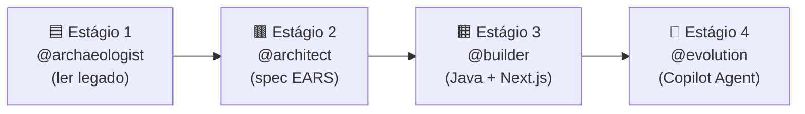

# Ordem de Execução dos Prompts — Workshop de Modernização SIFAP

> Referência rápida: qual agente usar em cada estágio e em que ordem invocar seus prompts.

---

## Visão Geral — 4 Agentes, 4 Estágios

A passagem de bastão entre estágios: o **último prompt de cada agente** gera o artefato que alimenta o próximo agente.

---

## Estágio 1 — `@archaeologist` — Leitura do Legado

**Agente:** [archaeologist.agent.md](../.github/agents/archaeologist.agent.md)
**Protagonista:** Requirements Engineer
**Pasta de artefatos:** `01-arqueologia/`

| # | Comando | Prompt | Artefato produzido | Pré-requisito |
|---|---------|--------|--------------------|---------------|
| 1 | `/archaeology-kickoff` | [stage-archaeologist-archaeology-kickoff.prompt.md](../.github/prompts/stage-archaeologist-archaeology-kickoff.prompt.md) | `01-arqueologia/inventory.md` | Acesso à pasta legado |
| 2 | `/extract-business-rules` | [stage-archaeologist-extract-business-rules.prompt.md](../.github/prompts/stage-archaeologist-extract-business-rules.prompt.md) | Anexa a `business-rules-catalog.md` | `inventory.md` + escolher 1 programa `.NSN` |
| 3 | `/map-dependencies` | [stage-archaeologist-map-dependencies.prompt.md](../.github/prompts/stage-archaeologist-map-dependencies.prompt.md) | `dependency-map.md` (call graph) | Ter lido alguns programas com `/extract-business-rules` |
| 4 | `/catalog-mysteries` | [stage-archaeologist-catalog-mysteries.prompt.md](../.github/prompts/stage-archaeologist-catalog-mysteries.prompt.md) | `mysteries-found.md` | Após #2 e #3 |
| 5 | `/discovery-report` | [stage-archaeologist-discovery-report.prompt.md](../.github/prompts/stage-archaeologist-discovery-report.prompt.md) | `discovery-report.md` → **passagem para Estágio 2** | Todos os anteriores concluídos |

> **Nota:** os prompts #2 e #3 podem ser intercalados — ler um programa gera regras (#2) e revela chamadas a outros programas (#3).

### Definição de Pronto do Estágio 1

- [ ] `inventory.md` com estrutura, contagens e ordem de leitura
- [ ] `business-rules-catalog.md` com ≥ 5 regras rastreadas até linha do `.NSN`
- [ ] `dependency-map.md` com todos os 15 programas e 4 DDMs
- [ ] `mysteries-found.md` com ≥ 3 mistérios identificados
- [ ] `discovery-report.md` revisado e assinado pelo time

---

## Estágio 2 — `@architect` — Spec Moderna (EARS + ADRs)

**Agente:** [architect.agent.md](../.github/agents/architect.agent.md)
**Protagonista:** Software Architect
**Pasta de artefatos:** `02-spec-moderna/`
**Entrada:** `01-arqueologia/discovery-report.md`

| # | Comando | Prompt | Artefato produzido |
|---|---------|--------|--------------------|
| 1 | `/carve-bounded-contexts` | [stage-architect-carve-bounded-contexts.prompt.md](../.github/prompts/stage-architect-carve-bounded-contexts.prompt.md) | Diagrama de bounded contexts |
| 2 | `/write-ears-spec` | [stage-architect-write-ears-spec.prompt.md](../.github/prompts/stage-architect-write-ears-spec.prompt.md) | `SPECIFICATION.md` com REQ-IDs e EARS |
| 3 | `/generate-adr` | [stage-architect-generate-adr.prompt.md](../.github/prompts/stage-architect-generate-adr.prompt.md) | `ADR-NNN.md` por decisão de arquitetura |
| 4 | `/design-modular-monolith` | [stage-architect-design-modular-monolith.prompt.md](../.github/prompts/stage-architect-design-modular-monolith.prompt.md) | Diagrama C4 + esqueleto OpenAPI → **passagem para Estágio 3** |

> O Spec-Kit entra neste estágio: `speckit.constitution` → `speckit.specify` → `speckit.clarify` → `speckit.plan` → `speckit.tasks` → `speckit.analyze`.

---

## Estágio 3 — `@builder` — Implementação (Java + Next.js)

**Agente:** [builder.agent.md](../.github/agents/builder.agent.md)
**Protagonista:** Tech Lead + Developer
**Pasta de artefatos:** `03-implementacao/`
**Entrada:** `02-spec-moderna/SPECIFICATION.md` + OpenAPI

| # | Comando | Prompt | Artefato produzido |
|---|---------|--------|--------------------|
| 1 | `/generate-jpa-from-fdt` | [stage-builder-generate-jpa-from-fdt.prompt.md](../.github/prompts/stage-builder-generate-jpa-from-fdt.prompt.md) | Entidades JPA + migrations Flyway |
| 2 | `/translate-natural-to-java` | [stage-builder-translate-natural-to-java.prompt.md](../.github/prompts/stage-builder-translate-natural-to-java.prompt.md) | Classes Java 21 + Spring Boot equivalentes |
| 3 | `/generate-equivalence-tests` | [stage-builder-generate-equivalence-tests.prompt.md](../.github/prompts/stage-builder-generate-equivalence-tests.prompt.md) | Testes JUnit provando equivalência com o legado |
| 4 | `/implement-rest-controller` | [stage-builder-implement-rest-controller.prompt.md](../.github/prompts/stage-builder-implement-rest-controller.prompt.md) | Controller REST a partir do contrato OpenAPI |
| 5 | `/security-self-review` | [stage-builder-security-self-review.prompt.md](../.github/prompts/stage-builder-security-self-review.prompt.md) | Checklist OWASP Top 10 na feature |

> A ordem aqui é intencional: **dados → lógica → testes → API → segurança**. O #1 vem primeiro porque o schema sustenta tudo.

---

## Estágio 4 — `@evolution` — Copilot Agent

**Agente:** [evolution.agent.md](../.github/agents/evolution.agent.md)
**Protagonista:** DevOps + Tech Lead
**Entrada:** codebase funcional do Estágio 3

| # | Comando | Prompt | Artefato produzido |
|---|---------|--------|--------------------|
| 1 | `/write-github-issue` | [stage-evolution-write-github-issue.prompt.md](../.github/prompts/stage-evolution-write-github-issue.prompt.md) | GitHub Issue otimizada para o Copilot Agent |
| 2 | `/delegate-to-copilot-agent` | [stage-evolution-delegate-to-copilot-agent.prompt.md](../.github/prompts/stage-evolution-delegate-to-copilot-agent.prompt.md) | Issue entregue ao Agent + watch-list de supervisão |
| 3 | `/review-agent-pr` | [stage-evolution-review-agent-pr.prompt.md](../.github/prompts/stage-evolution-review-agent-pr.prompt.md) | PR gerado por IA revisado e aprovado |
| 4 | `/final-experience-report` | [stage-evolution-final-experience-report.prompt.md](../.github/prompts/stage-evolution-final-experience-report.prompt.md) | Retrospectiva da equipe |

---

## Três Famílias de Prompts na Pasta `.github/prompts/`

| Prefixo | Quem usa | Quando |
|---------|----------|--------|
| `stage-archaeologist-*` | `@archaeologist` | Estágio 1 — na ordem acima |
| `stage-architect-*` | `@architect` | Estágio 2 — na ordem acima |
| `stage-builder-*` | `@builder` | Estágio 3 — na ordem acima |
| `stage-evolution-*` | `@evolution` | Estágio 4 — na ordem acima |
| `persona-*` | Persona individual (ex.: `@dba`, `@developer`) | Qualquer estágio — ferramenta pontual por papel |
| `speckit.*` | `@architect` + todo o time | Estágio 2 — fluxo SDD do Spec-Kit |

---

## Como Invocar um Prompt

1. Abra o chat do GitHub Copilot.
2. Selecione o **modo Agent**.
3. Digite `@` e escolha o agente do estágio (ex.: `@archaeologist`).
4. No campo de mensagem, use `/` e o nome do comando (ex.: `/archaeology-kickoff path=01-arqueologia/legado-sifap/`).

---

*Gerado em 2026-06-10 · baseado em [archaeologist.agent.md](../.github/agents/archaeologist.agent.md) e nos arquivos de prompt em `.github/prompts/`.*
 