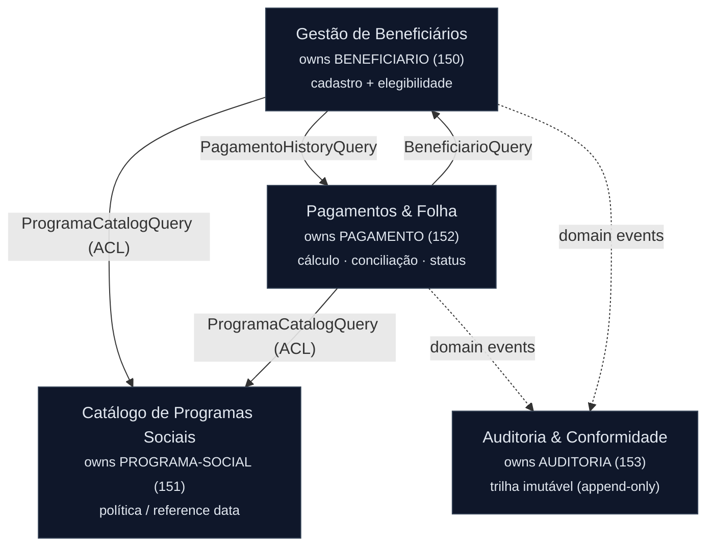

<!-- markdownlint-disable MD013 MD025 MD026 MD028 MD029 MD034 MD040 MD051 MD060 -->

# Mapa de Bounded Contexts — SIFAP Moderno

  

> Produzido por `/carve-bounded-contexts report=01-arqueologia/discovery-report.md`.
> Avalia as 5 hipóteses de recorte da [§6.1 do discovery-report](../01-arqueologia/discovery-report.md#61-hipóteses-de-recorte-bounded-contexts--para-o-architect-agent) contra coesão, acoplamento e frequência de mudança, e decide os bounded contexts do **Modular Monolith**.
>
> ⚠️ **Decisão pendente de validação da equipe.** As recomendações abaixo estão fundamentadas no código legado (dependency-map + business-rules-catalog). A equipe (Software Architect + Product Owner) toma a decisão final nas seções marcadas com 🟡 **DECISÃO DA EQUIPE**.

---

## Critérios de Avaliação

Cada hipótese é pontuada **High / Medium / Low** em três eixos:

| Critério | Pergunta | Fonte de evidência | Bom sinal |
| -------- | -------- | ------------------ | --------- |
| **Coesão** | As regras de negócio do grupo pertencem à mesma capacidade? | [business-rules-catalog.md](../01-arqueologia/business-rules-catalog.md) | **High** = candidato forte |
| **Acoplamento** | Quantas dependências cruzam a fronteira proposta? | [dependency-map.md](../01-arqueologia/dependency-map.md) (34 arestas program→data) | **Low** = candidato forte |
| **Frequência de mudança** | Os programas do grupo mudavam juntos no legado? | Histórico de alterações nos cabeçalhos `.NSN` + proximidade de dados | Mudam juntos = mesmo contexto |

> **Nota sobre acoplamento:** o legado tem **0 arestas program→program** (não há `CALLNAT`/`INCLUDE`). Todo acoplamento é **program→data** sobre os 4 arquivos Adabas. Portanto, a fronteira certa é a **propriedade do dado**: quem é dono de qual DDM. Leituras cruzadas de um DDM "de outro contexto" são o principal sinal de acoplamento.

---

## Avaliação de Hipóteses

### Hipótese 1 — Cadastro de Beneficiários — ✅ ACEITA (expandida)

**Escopo proposto:** `CADBENEF`, `CADDEPEND`, `VALBENEF`, `VALDOCS`, `CONSBENF` · dono de `BENEFICIARIO` (FNR 150).

| Critério | Score | Justificativa |
| -------- | ----- | ------------- |
| Coesão | **High** | Todo o grupo gira em torno do ciclo de vida cadastral e suas validações. A validação de CPF está **triplicada** (CADBENEF inline, VALBENEF, VALDOCS) — forte sinal de que pertencem ao mesmo contexto e devem ser **unificadas** numa única regra. |
| Acoplamento | **Low–Medium** | `BENEFICIARIO` é escrito **só** por CADBENEF/CADDEPEND. Leituras inbound (VALELEG, CALCBENF, CALCDSCT, BATCHPGT, BATCHREL, RELPGT) chegam de fora — bom, a propriedade é clara. Única saída: `CONSBENF → PAGAMENTO` (1 aresta de leitura de histórico). |
| Freq. mudança | **Medium** | Programas de cadastro mudam por novas regras de validação documental; evoluem juntos. |

**Recomendação:** ACEITAR e **absorver a Hipótese 3 (Elegibilidade)** — ver abaixo. Renomear para refletir que o contexto também decide a **concessão/admissão** do benefício.

---

### Hipótese 2 — Catálogo de Programas Sociais — ✅ ACEITA

**Escopo proposto:** `CADPROG` · dono de `PROGRAMA-SOCIAL` (FNR 151).

| Critério | Score | Justificativa |
| -------- | ----- | ------------- |
| Coesão | **High** | Dados paramétricos coesos: ~45 registros estáveis com `VLR-BASE`, fatores regionais, faixas de cálculo, `FATOR-K` ([MYS-001](../01-arqueologia/mysteries-found.md)) e regras de elegibilidade por tipo (A/P/T). |
| Acoplamento | **Low** | `PROGRAMA-SOCIAL` é escrito **só** por CADPROG. Lido por VALELEG, CALCBENF, BATCHPGT — todas leituras inbound. Não escreve em nenhum outro DDM. Acoplamento mínimo. |
| Freq. mudança | **Low** | Reference data estável (~45 registros, ~29 anos). Muda raramente, de forma independente do resto. |

**Recomendação:** ACEITAR como **contexto de referência (supporting)**. Baixa frequência de mudança + propriedade de dado exclusiva justificam um contexto próprio, mesmo sendo pequeno. Publica "linguagem publicada" (política de programa) consumida por Beneficiários e Pagamentos.

---

### Hipótese 3 — Elegibilidade — ❌ REJEITADA como contexto isolado (absorvida pela H1)

**Escopo proposto:** `VALELEG` · lê `BENEFICIARIO` + `PROGRAMA-SOCIAL` (não possui DDM próprio).

| Critério | Score | Justificativa |
| -------- | ----- | ------------- |
| Coesão | **Medium** | Um único programa de decisão. A regra de elegibilidade (tipo A/P/T, idade, renda, dependentes, **backdoor região 99**) está acoplada às políticas do programa e aos dados do beneficiário. |
| Acoplamento | **High** | **Não possui dado próprio.** Lê 2 DDMs de outros contextos (BEN + PRG). Um contexto sem ownership de dado é um **serviço de domínio anêmico**, não um bounded context. |
| Freq. mudança | **Low–Medium** | Muda quando muda a política de concessão — que é a mesma cadência da admissão do beneficiário. |

**Recomendação:** REJEITAR como contexto autônomo. Elegibilidade é a **decisão de concessão** do benefício: pertence ao contexto de Beneficiários (que é dono da admissão), **consumindo** a política de `PROGRAMA-SOCIAL` via interface (anti-corruption layer). Isso evita um contexto sem dados e mantém a decisão de "quem pode receber" junto de "quem é o beneficiário". O backdoor região 99 vira uma **decisão de produto explícita** dentro desse contexto.

---

### Hipótese 4 — Cálculo & Folha de Pagamento — ✅ ACEITA (dona do PAGAMENTO)

**Escopo proposto:** `CALCBENF`, `CALCDSCT`, `CALCCORR`, `BATCHPGT` · dona de `PAGAMENTO` (FNR 152).

| Critério | Score | Justificativa |
| -------- | ----- | ------------- |
| Coesão | **High** | Núcleo financeiro: cálculo do benefício, descontos, correção e geração da folha. É aqui que mora a **lógica duplicada a unificar** (CALCBENF × BATCHPGT — [MYS-023](../01-arqueologia/mysteries-found.md)) e a dupla aplicação de reajuste ([MYS-021](../01-arqueologia/mysteries-found.md)). |
| Acoplamento | **Medium** | Dona exclusiva de `PAGAMENTO` (STORE/UPDATE). Lê BEN + PRG (inbound de outros contextos via interface). O risco é que `PAGAMENTO` é o **hub** (8 programas o tocam) — ver resolução da tensão abaixo. |
| Freq. mudança | **High** | Cabeçalhos dos `.NSN` mostram alterações financeiras recorrentes: 2001 (13º), 2004 (fator regional), 2009 (abono), 2013 (faixas de renda). É a área de maior volatilidade. |

**Recomendação:** ACEITAR como **dona única de `PAGAMENTO`** e da **máquina de status** (fonte única de verdade — resolve [MYS-024](../01-arqueologia/mysteries-found.md)). Absorver a **conciliação** (`BATCHCON`, lado-pagamento) da Hipótese 5 — ver abaixo.

---

### Hipótese 5 — Conciliação, Auditoria & Relatórios — ❌ REJEITADA como bloco único (dividida)

**Escopo proposto:** `BATCHCON`, `BATCHREL`, `RELPGT`, `RELAUDIT` · dona de `PAGAMENTO` + `AUDITORIA`.

| Critério | Score | Justificativa |
| -------- | ----- | ------------- |
| Coesão | **Low** | Mistura **três** capacidades distintas: (a) conciliação bancária CNAB que **muta `PAGAMENTO`**, (b) trilha de auditoria imutável sobre `AUDITORIA`, (c) relatórios read-only. Coesão baixa por agrupar coisas diferentes. |
| Acoplamento | **High** | `BATCHCON` **escreve em `PAGAMENTO`** (dono da H4) → write cross-boundary, péssimo sinal. Dois contextos escrevendo no mesmo DDM é exatamente a tensão apontada no discovery-report. |
| Freq. mudança | **Mixed** | Conciliação muda com regras bancárias (CNAB multi-banco); auditoria é estável por compliance (IN-TCU 63); relatórios mudam por demanda de saída. Cadências diferentes ⇒ contextos diferentes. |

**Recomendação:** REJEITAR o bloco único e **dividir em três destinos**:

1. **Conciliação (`BATCHCON`, transições P/D/E):** mover para **Pagamentos**. Mudar `SIT-PAGAMENTO` é parte do **ciclo de vida do pagamento** — pertence a quem é dono de `PAGAMENTO`. Elimina o write cross-boundary e dá fonte única à máquina de status.
2. **Auditoria (`RELAUDIT` + a gravação de `AUDITORIA`):** **novo contexto próprio** — dado exclusivo (`AUDITORIA`, FNR 153, imutável, retenção 10 anos, IN-TCU 63). Recebe eventos de domínio dos outros contextos; **remove o encobrimento de exclusões** (compliance).
3. **Relatórios (`RELPGT`, `BATCHREL`):** capacidade **read-only transversal**. Consultas que leem dados próprios de Pagamentos + nomes de Beneficiário via interface. Não justificam ownership de dado ⇒ vivem como *queries* dentro de Pagamentos (relatórios de folha), consumindo Beneficiários como linguagem publicada.

---

## Bounded Contexts Finais

🟡 **DECISÃO DA EQUIPE** — recomendação do `@architect-agent`: **4 bounded contexts**. Confirme ou ajuste antes do design do Modular Monolith.

### 1. Gestão de Beneficiários *(Beneficiaries)*

- **Responsabilidade:** Possui o ciclo de vida cadastral do beneficiário e de seus dependentes, a validação de identidade/documentos (CPF Módulo 11 unificado — fim da triplicação CADBENEF/VALBENEF/VALDOCS) e a **decisão de concessão/elegibilidade** (tipo A/P/T, idade, renda, dependentes). É a fonte de verdade sobre **quem é o beneficiário e se ele pode receber**. Consome a política de programa como linguagem publicada e não conhece valores de pagamento (apenas consulta histórico para exibição).
- **Dados próprios (DDMs/tabelas):** `BENEFICIARIO` (FNR 150) — incluindo dependentes (PE), status (A/S/C/I/D), região, renda familiar, data de nascimento.
- **Interface pública:**
  - `BeneficiarioQuery.findByCpf(cpf) → BeneficiarioSnapshot` (região, dependentes, renda, idade, status) — consumida por Pagamentos
  - `ElegibilidadeService.avaliar(cpf, codPrograma) → ResultadoElegibilidade`
  - Emite evento `BeneficiarioExcluido` / `BeneficiarioStatusAlterado` → Auditoria
- **Por que é um contexto próprio:** coesão **High** + ownership exclusiva de `BENEFICIARIO`; absorve Elegibilidade (H3) por ser uma decisão de admissão sem dado próprio.

### 2. Catálogo de Programas Sociais *(Programs)*

- **Responsabilidade:** Mantém o conjunto paramétrico estável de programas sociais (~45 registros): `VLR-BASE`, fatores regionais, faixas de cálculo, reajuste, `FATOR-K` ([MYS-001](../01-arqueologia/mysteries-found.md)) e os critérios de elegibilidade por tipo de programa. É a **linguagem publicada** de política de benefício consumida pelos demais contextos. Externaliza as tabelas hardcoded do legado (IPCA, regional, faixas) como parâmetros versionados.
- **Dados próprios (DDMs/tabelas):** `PROGRAMA-SOCIAL` (FNR 151).
- **Interface pública:**
  - `ProgramaCatalogQuery.findByCodigo(cod) → ProgramaPolicy` (vlrBase, tipo, fatores, reajuste, fatorK, regras de elegibilidade)
  - `ProgramaCatalogQuery.listAtivos() → List<ProgramaPolicy>`
- **Por que é um contexto próprio:** acoplamento **Low** + frequência de mudança **Low** (reference data estável) + ownership exclusiva de `PROGRAMA-SOCIAL`.

### 3. Pagamentos & Folha *(Payments)*

- **Responsabilidade:** Núcleo financeiro. Calcula o benefício mensal (regional × familiar × renda × idade × reajuste, truncado), descontos (teto 30%, isenção judicial), 13º/abono natalino e correção monetária; gera a folha mensal em lote; remete ao banco (CNAB 240); **concilia o retorno bancário** e governa a **máquina de status** de `PAGAMENTO` como **fonte única de verdade** (resolve [MYS-024](../01-arqueologia/mysteries-found.md)/[MYS-025](../01-arqueologia/mysteries-found.md)). Unifica a lógica duplicada CALCBENF × BATCHPGT ([MYS-023](../01-arqueologia/mysteries-found.md)). Produz os relatórios de folha. Detém os dados bancários (que vivem em `PAGAMENTO`, não no cadastro — [MYS-010](../01-arqueologia/dependency-map.md)).
- **Dados próprios (DDMs/tabelas):** `PAGAMENTO` (FNR 152, ~180 mi reg.) — único contexto que escreve aqui.
- **Interface pública:**
  - `PagamentoCommand.gerarFolha(competencia)` / `conciliarRetorno(arquivoCnab)` / `aplicarCorrecao(...)`
  - `PagamentoHistoryQuery.findByCpf(cpf) → List<PagamentoResumo>` — consumida por Beneficiários (CONSBENF)
  - Emite eventos `PagamentoGerado`, `PagamentoConciliado`, `PagamentoDevolvido`, `PagamentoEstornado` → Auditoria
- **Por que é um contexto próprio:** coesão **High** + frequência de mudança **High** + ownership exclusiva do hub `PAGAMENTO`; absorve a conciliação (lado-pagamento da H5) para eliminar write cross-boundary.

### 4. Auditoria & Conformidade *(Audit)*

- **Responsabilidade:** Mantém a trilha de auditoria **imutável** (IN-TCU 63/2010, retenção 10 anos), consumindo eventos de domínio dos demais contextos. **Remove o encobrimento de exclusões** do legado ([MYS-S1](../01-arqueologia/discovery-report.md#41-mistérios-não-resolvidos)) — toda exclusão é registrada. Produz a trilha de auditoria (RELAUDIT). Não muta dado de negócio: só **acrescenta** registros append-only.
- **Dados próprios (DDMs/tabelas):** `AUDITORIA` (FNR 153, ~25 mi reg., append-only).
- **Interface pública:**
  - Subscreve eventos: `PagamentoConciliado`, `PagamentoDevolvido`, `BeneficiarioExcluido`, etc.
  - `AuditoriaQuery.findByPeriodo(de, ate) → List<EventoAuditoria>`
- **Por que é um contexto próprio:** coesão e regras de compliance distintas + ownership exclusiva de `AUDITORIA` (imutável) + cadência de mudança própria (estável por regulação).

> **Tensão resolvida (PAGAMENTO compartilhado entre H4 e H5):** Pagamentos é o **único dono** de `PAGAMENTO` e de sua máquina de status. A conciliação deixou de ser write cross-boundary (virou comando interno de Pagamentos). Auditoria não escreve em `PAGAMENTO` — recebe **eventos de domínio** e mantém sua própria trilha imutável. Fonte única de verdade preservada.

---

## Comunicação Inter-Context

> **Modular Monolith:** toda comunicação é **in-process** (chamada de método via interface ou domain event in-VM). **Nada de HTTP entre serviços.** Apenas **IDs e DTOs/snapshots** atravessam fronteiras — nunca entidades JPA gerenciadas. Eventos de domínio são one-way e desacoplados.

| Origem | Alvo | Direção | Mecanismo | Dados trocados |
| ------ | ---- | ------- | --------- | -------------- |
| Beneficiários | Programas | A → B | Interface `ProgramaCatalogQuery` (ACL) | `codPrograma` → `ProgramaPolicy` (DTO, read-only) |
| Pagamentos | Beneficiários | A → B | Interface `BeneficiarioQuery` | `cpf` → `BeneficiarioSnapshot` (região, dependentes, renda, idade, status) |
| Pagamentos | Programas | A → B | Interface `ProgramaCatalogQuery` | `codPrograma` → `ProgramaPolicy` (vlrBase, fatores, reajuste, fatorK) |
| Beneficiários | Pagamentos | A → B | Interface `PagamentoHistoryQuery` | `cpf` → `List<PagamentoResumo>` (consulta CONSBENF) |
| Pagamentos | Auditoria | A → B (one-way) | Domain events | `PagamentoGerado/Conciliado/Devolvido/Estornado` (evento) |
| Beneficiários | Auditoria | A → B (one-way) | Domain events | `BeneficiarioExcluido/StatusAlterado` (evento) |

**Shared kernel (tipos transversais mínimos):** `Cpf` (value object com Módulo 11 + máscara LGPD unificada), `Competencia` (AAAAMM), `Money` (truncamento a 2 casas), `CodPrograma`. Mantê-lo deliberadamente pequeno — só tipos de identidade/valor, nunca regra de negócio de um contexto específico.

**Regras de fronteira:**

- Beneficiários e Programas **não** conhecem `PAGAMENTO`. Só Pagamentos escreve nele.
- Auditoria **nunca** é chamada de forma síncrona para mutar negócio; só recebe eventos e responde queries.
- Anti-corruption layer em Pagamentos e Beneficiários ao consumir `ProgramaPolicy` (traduz o modelo de Programas para o vocabulário local).

---

## Diagrama Mermaid do Mapa de Contexto

> Setas sólidas = chamada de método in-process via interface (síncrona, read). Setas tracejadas = domain events (one-way, assíncrono-lógico, desacoplado).

---

## Definição de Pronto

- [x] Todas as 5 hipóteses do discovery-report avaliadas contra os 3 critérios (scorecards acima)
- [x] Hipóteses rejeitadas têm raciocínio documentado (H3 absorvida; H5 dividida em 3)
- [x] 4 bounded contexts finalizados com nomes em linguagem de negócio
- [x] Cada contexto tem responsabilidade, dados próprios e esboço de interface pública
- [x] Diagrama Mermaid de context map com relacionamentos
- [x] Nenhum contexto isolado — todos os caminhos de comunicação definidos
- [ ] 🟡 **Validação da equipe** (Software Architect + Product Owner) — confirmar o recorte de 4 contextos e a propriedade de `PAGAMENTO` por Pagamentos

---

## Próximos Passos (Estágio 2)

1. **Validar este recorte** com a equipe (decisões 🟡 acima).
2. **`/generate-adr`** para as decisões estruturais derivadas daqui:
   - ADR: Pagamentos como dono único de `PAGAMENTO` e da máquina de status (resolve MYS-024).
   - ADR: Auditoria desacoplada por domain events + remoção do encobrimento de exclusões.
   - ADR: estratégia de mapeamento Adabas→JPA (MU/PE → `@ElementCollection`/`@OneToMany`).
3. **`/write-ears-spec`** por contexto, cada EARS com `source_legacy:` apontando para `business-rules-catalog.md`.
4. **`/design-modular-monolith`** — módulos Maven package-by-feature espelhando estes 4 contextos + shared kernel.
