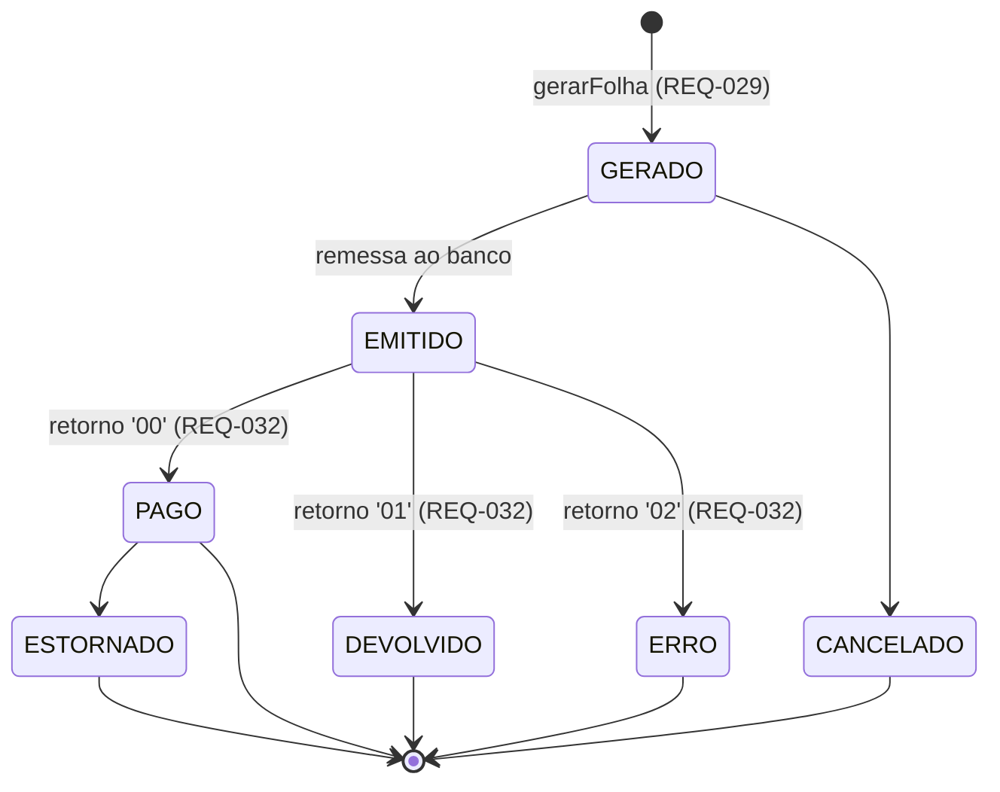
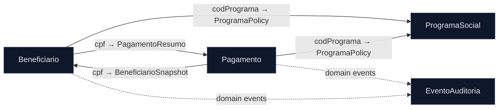

# Phase 1 — Data Model: SIFAP Core Modernization

> Output of `/speckit.plan` Phase 1. Target domain entities per bounded context, derived from the legacy DDMs (FNR 150–153), [SPECIFICATION.md](SPECIFICATION.md), and [ADRs](ADRs/). This is the **conceptual/JPA-level** model; column DDL and Flyway migrations are produced in Stage 3. Validation rules cite their REQ; ownership follows [bounded-contexts.md](bounded-contexts.md).

## Conventions

- One schema per context. Entities live in `domain/`; only DTO `record`s cross module boundaries (Principle IV).
- Value objects (shared kernel): `Cpf` (Módulo 11 + unified mask, REQ-001/015), `Competencia` (AAAAMM), `Money` (truncated 2 decimals, REQ-021), `CodPrograma`.
- Money is `NUMERIC(11,2)`; truncation (not rounding) enforced in `Money` (REQ-021).
- Legacy field origin shown as `← DDM.FIELD`.

---

## Context: Beneficiaries (schema `beneficiaries`, ← BENEFICIARIO / FNR 150)

### Entity: `Beneficiario`

| Field | Type | Legacy | Rules |
| ----- | ---- | ------ | ----- |
| `id` | Long (PK) | ← AA NUM-INSCRICAO | matrícula/ISN alternativo |
| `cpf` | `Cpf` (unique) | ← AB NUM-CPF | required, Módulo 11, not all-equal (REQ-001/003) |
| `nome` | String(60) | ← AC NOME-COMPLETO | required, ≥1 space (nome+sobrenome) (REQ-002/004) |
| `dataNascimento` | LocalDate | ← AF DT-NASCIMENTO | required (REQ-004) |
| `sexo` | enum M/F/I | ← AG SEXO | required (REQ cadastro) |
| `uf` | String(2) | ← BG UF | one of 27 UFs (REQ-002) |
| `codRegiao` | String(2) | ← BJ COD-REGIAO | 01–05 or 99 (99 = special, see OQ-S1) |
| `codPrograma` | `CodPrograma` | ← CA COD-PROGRAMA | FK to Programs (by value, via SPI) |
| `rendaFamiliar` | `Money` | ← CH VLR-RENDA-FAMILIAR | used by eligibility (REQ-013) |
| `numDependentes` | int | ← (derived) | 0..5 (REQ-009) |
| `status` | `StatusBeneficiario` | ← CE SIT-BENEFICIARIO | A/S/C/I/D (REQ-007) |
| `nis` | String | ← BENEFICIARIO.NIS | optional; used by specific eligibility |
| `dependentes` | List<`Dependente`> | ← DA GRP-DEPENDENTE (PE, max 10) | `@ElementCollection`, max 5 enforced (REQ-009, ADR-003) |
| audit cols | — | ← GA..GG | dtCadastro, dtAtualizacao |

**State machine — `StatusBeneficiario`** (REQ-006/007/008):
`A` (inicial, REQ-006) → `S` | `C` | `I` | `D`. Auto-transition: age > 75 ⇒ `S` at cadastro (REQ-008). Valid set `{A,S,C,I,D}`.

### Value/Embeddable: `Dependente` (← DB..DG)

| Field | Type | Rules |
| ----- | ---- | ----- |
| `cpfDependente` | `Cpf` opt | optional (may be absent) |
| `nome` | String(60) | required (REQ cadastro) |
| `dataNascimento` | LocalDate | — |
| `parentesco` | enum | one of FI/CO/IR/OU (REQ-011) |

**Relationships:** `Beneficiario` 1—N `Dependente` (owned, child table `beneficiario_dependente`). Reads `ProgramaPolicy` from Programs via SPI for eligibility (REQ-013/014). Publishes `BeneficiarioExcluido`/`BeneficiarioStatusAlterado` events → Audit (REQ-037).

---

## Context: Programs (schema `programs`, ← PROGRAMA-SOCIAL / FNR 151)

### Entity: `ProgramaSocial`

| Field | Type | Legacy | Rules |
| ----- | ---- | ------ | ----- |
| `codigo` | `CodPrograma` (PK) | ← AA COD-PROGRAMA | unique (REQ-016) |
| `nome` | String(60) | ← AB NOME-PROGRAMA | required |
| `tipo` | enum A/P/T | ← AD TIPO-PROGRAMA | drives eligibility (REQ-014) |
| `vlrBase` | `Money` | ← BA VLR-BASE-INDIVIDUAL | **stored already adjusted by Fator-K** (REQ-017) |
| `fatorReajuste` | BigDecimal(3,2) | ← BE PCT-REAJUSTE-ANUAL | applied monthly (REQ-018) |
| `fatorK` | BigDecimal(5,4) | ← BG FATOR-K | persisted; origin of `0.347215` is OQ-04 |
| `idadeMin` | Integer | ← CB IDADE-MIN | 0 = none (REQ-013) |
| `idadeMax` | Integer | ← CC IDADE-MAX | 0 = none (REQ-013) |
| `rendaMax` | `Money` | ← CA RENDA-MAX-PERCAP | 0 = none (REQ-013) |
| `statusPrograma` | enum A/I/E | ← AI SIT-PROGRAMA | only active programs eligible |
| `descontosAplicaveis` | Set<`TipoDesconto`> | ← EA TIPO-DSCT-APLIC (MU, max 8) | `@ElementCollection` enum (ADR-001) |
| `faixas` | List<`FaixaCalculo`> | ← DA GRP-FAIXA-CALCULO (PE, max 5) | `@ElementCollection` (ADR-003) |
| `parametrosRegionais` | List<`ParamRegional`> | ← FA GRP-PARAM-REGIONAL (PE, max 6) | `@ElementCollection` (ADR-003) |

**Enum `TipoDesconto`** (← DDM): IR, JD, CS, PA, EM, TX, OU, EX (controlled vocabulary, ADR-001).

**Invariants:** on inclusion, `vlrBase` persisted = informed × (1.00 + reajuste × fatorKConst) (REQ-017); reference data, low change frequency. **Owns no payment data.**

---

## Context: Payments & Folha (schema `payments`, ← PAGAMENTO / FNR 152)

### Entity: `Pagamento`

| Field | Type | Legacy | Rules |
| ----- | ---- | ------ | ----- |
| `numPagamento` | Long (PK, seq) | ← AA NUM-PAGAMENTO | unique sequential (REQ-029) |
| `cpf` | `Cpf` | ← AB NUM-CPF | index; matches a Beneficiario |
| `codPrograma` | `CodPrograma` | ← AD COD-PROGRAMA | by value |
| `competencia` | `Competencia` | ← AE ANO-MES-REF | AAAAMM; unique per (cpf, competencia) (REQ-030) |
| `tipo` | enum N/D/T | ← DA TIPO-PGTO | N=normal, D=décimo (REQ-022); T orphan (OQ) |
| `vlrBruto` | `Money` | ← BA VLR-BRUTO | (REQ-018) |
| `vlrDescontoTotal` | `Money` | ← BC VLR-DESCONTO-TOTAL | (REQ-025/026) |
| `vlrLiquido` | `Money` | ← BB VLR-LIQUIDO | floor 0 (REQ-028) |
| `vlrAbono` | `Money` | ← (abono) | 13º/abono in December (REQ-023) |
| `status` | `StatusPagamento` | ← DA SIT-PAGAMENTO | canonical machine (ADR-002) |
| `indCorrigido` | boolean | ← IND-CORRIGIDO | correction idempotency (REQ-034) |
| dados bancários | embedded | ← EA..EE | COD-BANCO/AGENCIA/CONTA/TIPO (per payment, [MYS-010]) |
| conciliação | embedded | ← GA..GE | dtConciliacao, codRetornoBanco, vlrConciliado (REQ-032/033) |
| `descontos` | List<`Desconto`> | ← CA GRP-DESCONTO (PE, max 8) | child table partitioned by competência (ADR-003) |

**State machine — `StatusPagamento`** (ADR-002, resolves OQ-01):

> `ERRO` and `ESTORNADO` are **distinct** (legacy 'E' collision resolved). Legacy codes normalized via a documented de-para at migration.

### Value/Embeddable: `Desconto` (← CB..CG)

| Field | Type | Rules |
| ----- | ---- | ----- |
| `tipo` | `TipoDesconto` | must be in program's `descontosAplicaveis` (ADR-001) |
| `valor` | `Money` | (REQ-026/027) |
| `percentual` | BigDecimal(3,2) | (REQ-027) |
| `numProcesso` | String(20) | required when tipo = JD (REQ-027) |
| `dtInicio`/`dtFim` | LocalDate | vigência window |

**Calculation rules (single unified rule, REQ-018, replaces CALCBENF×BATCHPGT, OQ-02):**
benefit = vlrBase × fatorRegional × fatorFamiliar × fatorRenda × fatorIdade × (1+reajuste); truncated (REQ-021). Contribution by bracket (REQ-025); 30% cap with judicial exemption (REQ-026); net floored at 0 (REQ-028). **Relationships:** reads `BeneficiarioSnapshot` (Beneficiaries SPI) and `ProgramaPolicy` (Programs SPI); publishes `PagamentoConciliado`/`PagamentoDevolvido`/`PagamentoEstornado`/`DivergenciaConciliacao` → Audit (REQ-036).

---

## Context: Audit & Compliance (schema `audit`, ← AUDITORIA / FNR 153)

### Entity: `EventoAuditoria` (append-only, immutable)

| Field | Type | Legacy | Rules |
| ----- | ---- | ------ | ----- |
| `id` | Long (PK, seq) | ← AA NUM-AUDITORIA | unique sequential |
| `timestamp` | Instant | ← AD TS-EVENTO | precision AAAAMMDDHHMMSS |
| `acao` | `AcaoAuditoria` | ← BA COD-ACAO | IN/AL/EX/CO/LG/LO/BT/ER/AU/RE |
| `tipoEntidade` | enum | ← CA TIPO-ENTIDADE | BENF/PGTO/PROG/ADMN/SIST |
| `idEntidade` | String(15) | ← CB ID-ENTIDADE | entity key |
| `cpfAfetado` | `Cpf` opt | ← CC NUM-CPF-AFETADO | masked on display |
| `valorAnterior`/`valorNovo` | JSONB | ← DA/DD GRP-ANTES/DEPOIS (MU) | before/after snapshot |
| `usuario` | String(8) | ← EA USR-EVENTO | actor (`BATCH` for batch) |
| `perfil` | enum | ← EC COD-PERFIL | ADM/OPR/CON/AUD/SUP |
| `ipOrigem` | String(15) | ← EE IP-ORIGEM | added 2012 |
| `idCorrelacao` | UUID | ← GA ID-CORRELACAO | composite-op tracing |

**Invariants:** insert-only — **no UPDATE/DELETE** (immutable, IN-TCU 63, 10-year retention). Exclusions (`EX`) are **always visible** on query (REQ-037 — legacy hid them; not reproduced). Populated by consuming domain events (ADR-004); never mutates business data.

> Note: `GRP-ANTES`/`GRP-DEPOIS` are MU before/after pairs — here represented as JSONB snapshots (document-like, write-whole audit payload), an acceptable JSONB use distinct from ADR-001/003 (those are queryable controlled data).

---

## Cross-Context Relationships (by value / event only)

No foreign keys cross schema boundaries; references are by identifier value resolved through SPI (Principle IV). The DTO records that cross boundaries are defined in [modular-monolith-design.md](modular-monolith-design.md) (`BeneficiarioSnapshot`, `ProgramaPolicy`, `PagamentoResumo`, `ResultadoElegibilidade`).
