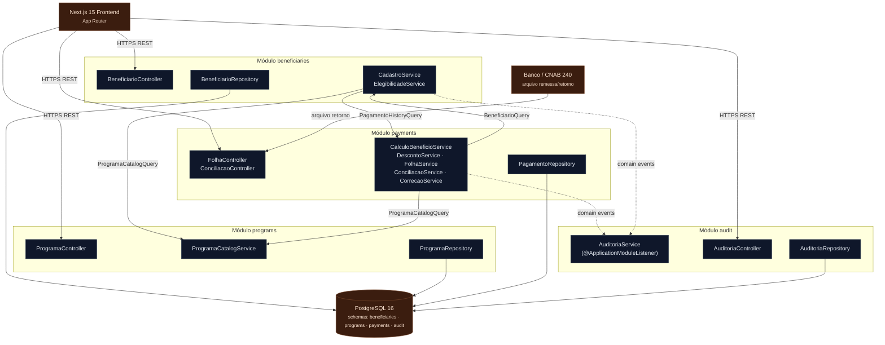

<!-- markdownlint-disable MD013 MD025 MD026 MD028 MD029 MD034 MD040 MD051 MD060 -->

# Design do Modular Monolith — SIFAP Moderno

  

> Produzido por `/design-modular-monolith package=com.datacorp.app communication=mixed`.
> Blueprint do Estágio 3. Fundamentado em [bounded-contexts.md](bounded-contexts.md), [SPECIFICATION.md](SPECIFICATION.md) e [ADR-001](ADRs/adr-001-map-adabas-mu-fields-to-jsonb-vs-elementcollection.md).

## Parâmetros do Design

| Parâmetro | Valor |
| --------- | ----- |
| Package base | `com.datacorp.app` |
| Estilo de comunicação inter-context | **Misto** — interfaces in-process para leituras síncronas; domain events para notificações one-way (auditoria) |
| Estilo de arquitetura | **Modular Monolith** — única unidade implantável, fronteiras de módulo por feature (package-by-feature) |
| Stack | Java 21 + Spring Boot 3.3 + Spring Modulith + JPA/Hibernate 6 + PostgreSQL 16 |
| Build | Maven multi-module (1 módulo por bounded context + `shared`) |

> **Modular Monolith, não microservices.** Os 4 módulos compartilham uma JVM, um deployment e (logicamente) um banco com schemas separados por contexto. Toda comunicação cross-context é **in-process**.

---

## Estrutura de Packages

Mapeamento **1:1** com os 4 bounded contexts de [bounded-contexts.md](bounded-contexts.md):

```
com.datacorp.app
├── beneficiaries/                 # BC1 — Gestão de Beneficiários (owns BENEFICIARIO / FNR 150)
│   ├── api/                       # REST controllers (público)
│   ├── domain/                    # Beneficiario, Dependente, Cpf, StatusBeneficiario (interno)
│   ├── service/                   # CadastroService, ElegibilidadeService (interno)
│   ├── repository/                # BeneficiarioRepository (interno)
│   └── spi/                       # Interfaces PÚBLICAS exportadas: BeneficiarioQuery, ElegibilidadeApi + DTOs
│
├── programs/                      # BC2 — Catálogo de Programas Sociais (owns PROGRAMA-SOCIAL / FNR 151)
│   ├── api/
│   ├── domain/                    # ProgramaSocial, TipoDesconto (enum), FaixaCalculo, ParamRegional
│   ├── service/                   # ProgramaCatalogService
│   ├── repository/
│   └── spi/                       # ProgramaCatalogQuery + ProgramaPolicy (DTO)
│
├── payments/                      # BC3 — Pagamentos & Folha (owns PAGAMENTO / FNR 152)
│   ├── api/
│   ├── domain/                    # Pagamento, StatusPagamento, Desconto, Money, Competencia
│   ├── service/                   # CalculoBeneficioService, DescontoService, FolhaService,
│   │                              #   ConciliacaoService, CorrecaoService
│   ├── repository/
│   └── spi/                       # PagamentoHistoryQuery + PagamentoResumo (DTO)
│
├── audit/                         # BC4 — Auditoria & Conformidade (owns AUDITORIA / FNR 153)
│   ├── api/
│   ├── domain/                    # EventoAuditoria (append-only), AcaoAuditoria
│   ├── service/                   # AuditoriaService (event listeners)
│   ├── repository/
│   └── spi/                       # AuditoriaQuery
│
└── shared/                        # Shared kernel — transversal, deliberadamente mínimo
    ├── kernel/                    # Cpf, Competencia, Money, CodPrograma (value objects)
    ├── events/                    # Marker types / base de domain events
    └── exception/                 # DomainException, ValidationException, ErrorResponse
```

**Regras de visibilidade (impostas por Spring Modulith + ArchUnit):**

- Apenas `api/` (controllers REST) e `spi/` (Service Provider Interface) são **públicos** a outros módulos.
- `domain/`, `service/`, `repository/` são **internos** ao módulo — nenhum outro contexto pode importá-los.
- `shared/kernel` só contém value objects de identidade/valor — **nunca** regra de negócio de um contexto específico.
- Nenhuma entidade JPA gerenciada cruza fronteira de módulo — só **records DTO** definidos em `spi/`.

---

## Interfaces de Módulo (SPI)

> Assinaturas exportadas por cada contexto. DTOs são `record` (Java 21). Retornos anuláveis usam `Optional`. **Sem** entidades JPA nas assinaturas.

### `beneficiaries/spi`

```java
public interface BeneficiarioQuery {
    Optional<BeneficiarioSnapshot> findByCpf(Cpf cpf);
}

public interface ElegibilidadeApi {
    ResultadoElegibilidade avaliar(Cpf cpf, CodPrograma codPrograma);
}

public record BeneficiarioSnapshot(
    Cpf cpf, String nome, String codRegiao,
    int numDependentes, Money rendaFamiliar,
    int idade, StatusBeneficiario status) {}

public record ResultadoElegibilidade(boolean elegivel, List<String> motivos) {}
```

### `programs/spi`

```java
public interface ProgramaCatalogQuery {
    Optional<ProgramaPolicy> findByCodigo(CodPrograma cod);
    List<ProgramaPolicy> listAtivos();
}

public record ProgramaPolicy(
    CodPrograma codigo, String nome, char tipo,            // A / P / T
    Money vlrBase, BigDecimal fatorReajuste, BigDecimal fatorK,
    Integer idadeMin, Integer idadeMax, Money rendaMax,
    Set<TipoDesconto> descontosAplicaveis,                 // ADR-001 → @ElementCollection/enum
    List<FaixaCalculoDto> faixas, List<ParamRegionalDto> regionais) {}
```

### `payments/spi`

```java
public interface PagamentoHistoryQuery {
    List<PagamentoResumo> findByCpf(Cpf cpf, int limite);  // CONSBENF: últimos N
}

public record PagamentoResumo(
    long numPagamento, Competencia competencia, char tipo, // N / D / T
    Money vlrBruto, Money vlrLiquido, StatusPagamento status) {}

// Comandos expostos via api/ (REST), não como SPI cross-context:
//   FolhaService.gerarFolha(Competencia)
//   ConciliacaoService.conciliarRetorno(ArquivoRetornoBancario)
//   CorrecaoService.aplicarCorrecao(Cpf, Competencia inicial, Competencia final)
```

### `audit/spi`

```java
public interface AuditoriaQuery {
    List<EventoAuditoria> findByPeriodo(LocalDate de, LocalDate ate,
                                        Optional<AcaoAuditoria> acao);
}
// Auditoria NÃO expõe métodos de escrita — só consome domain events (ver abaixo).
```

---

## Comunicação Cross-Context

🟡 **Decisão da equipe (estilo `communication=mixed`):** combinar os dois padrões conforme a natureza da interação.

### Padrão A — Interface in-process (síncrono, leitura)

Usado quando um contexto **precisa de um dado** de outro para completar uma operação. Acoplamento direto, simples, transacional.

| Origem | Alvo | Interface | Dados trocados | Requisitos |
| ------ | ---- | --------- | -------------- | ---------- |
| `payments` | `beneficiaries` | `BeneficiarioQuery` | `Cpf` → `BeneficiarioSnapshot` | REQ-018, REQ-024, REQ-029 |
| `payments` | `programs` | `ProgramaCatalogQuery` | `CodPrograma` → `ProgramaPolicy` | REQ-018…023, REQ-025 |
| `beneficiaries` | `programs` | `ProgramaCatalogQuery` (ACL) | `CodPrograma` → `ProgramaPolicy` | REQ-013, REQ-014 |
| `beneficiaries` | `payments` | `PagamentoHistoryQuery` | `Cpf` → `List<PagamentoResumo>` | REQ-015 (consulta CONSBENF) |

### Padrão B — Domain events (one-way, desacoplado)

Usado para **notificar** sem exigir resposta — toda a integração com **Auditoria**. Publicado via `ApplicationEventPublisher` (Spring) / Spring Modulith event publication, consumido por `@ApplicationModuleListener` em `audit`.

| Origem | Evento | Consumidor | Requisitos |
| ------ | ------ | ---------- | ---------- |
| `payments` | `PagamentoConciliadoEvent`, `PagamentoDevolvidoEvent`, `PagamentoEstornadoEvent` | `audit` | REQ-036 |
| `payments` | `DivergenciaConciliacaoEvent` | `audit` | REQ-033, REQ-036 |
| `beneficiaries` | `BeneficiarioExcluidoEvent`, `BeneficiarioStatusAlteradoEvent` | `audit` | REQ-037 (exclusões SEMPRE visíveis) |

**Regras de fronteira:**

- `beneficiaries` e `programs` **não** conhecem `PAGAMENTO`. Só `payments` escreve nele (resolve a tensão do hub — [OQ-01](SPECIFICATION.md#open-questions-não-são-requisitos-ainda)).
- `audit` **nunca** é chamado de forma síncrona para mutar negócio; só recebe eventos e responde queries — a trilha é **append-only** e exclusões são sempre auditadas (anti-encobrimento, REQ-037).
- Anti-corruption layer em `payments` e `beneficiaries` ao consumir `ProgramaPolicy`.

---

## Diagrama C4 Component (Level 3)



> Setas sólidas = chamada in-process via SPI (síncrona). Tracejadas = domain events (one-way). Todos os módulos compartilham a JVM e o PostgreSQL (schemas separados por contexto).

---

## Resumo de Endpoints

Convenção: `/api/v1/{resource}`. Todos com annotations OpenAPI. Detalhes de schema em [openapi.yaml](openapi.yaml).

### `beneficiaries`

| Método | Path | Resumo | Req body | Resp body | REQ |
| ------ | ---- | ------ | -------- | --------- | --- |
| POST | `/api/v1/beneficiarios` | Cadastra beneficiário | `BeneficiarioRequest` | `BeneficiarioResponse` | REQ-001…008 |
| PUT | `/api/v1/beneficiarios/{cpf}` | Altera beneficiário | `BeneficiarioUpdateRequest` | `BeneficiarioResponse` | REQ-007 |
| GET | `/api/v1/beneficiarios/{cpf}` | Consulta (CPF mascarado + histórico) | — | `BeneficiarioDetailResponse` | REQ-015 |
| POST | `/api/v1/beneficiarios/{cpf}/dependentes` | Inclui dependente | `DependenteRequest` | `DependenteResponse` | REQ-009…011 |
| GET | `/api/v1/beneficiarios/{cpf}/elegibilidade?programa={cod}` | Avalia elegibilidade | — | `ElegibilidadeResponse` | REQ-012…014 |

### `programs`

| Método | Path | Resumo | Req body | Resp body | REQ |
| ------ | ---- | ------ | -------- | --------- | --- |
| POST | `/api/v1/programas` | Cadastra programa (aplica Fator-K) | `ProgramaRequest` | `ProgramaResponse` | REQ-016, REQ-017 |
| GET | `/api/v1/programas` | Lista programas ativos | — | `ProgramaResponse[]` | REQ-014 |
| GET | `/api/v1/programas/{cod}` | Detalha programa | — | `ProgramaResponse` | REQ-017 |

### `payments`

| Método | Path | Resumo | Req body | Resp body | REQ |
| ------ | ---- | ------ | -------- | --------- | --- |
| POST | `/api/v1/folhas` | Gera folha mensal por competência | `GerarFolhaRequest` | `FolhaResumoResponse` | REQ-029…031 |
| GET | `/api/v1/pagamentos?cpf={cpf}&competencia={aaaamm}` | Consulta pagamentos | — | `PagamentoResponse[]` | REQ-015 |
| POST | `/api/v1/conciliacoes` | Concilia retorno bancário CNAB | `ConciliacaoRequest` | `ConciliacaoResumoResponse` | REQ-032, REQ-033 |
| POST | `/api/v1/correcoes` | Aplica correção monetária | `CorrecaoRequest` | `CorrecaoResponse` | REQ-034 |
| GET | `/api/v1/relatorios/consolidado?competencia={aaaamm}` | Relatório consolidado | — | `RelatorioConsolidadoResponse` | REQ-035 |

### `audit`

| Método | Path | Resumo | Req body | Resp body | REQ |
| ------ | ---- | ------ | -------- | --------- | --- |
| GET | `/api/v1/auditoria?de={data}&ate={data}&acao={acao}` | Consulta trilha (exclusões visíveis) | — | `EventoAuditoriaResponse[]` | REQ-036, REQ-037 |

---

## ADRs Relacionados

| ADR | Afeta | Como |
| --- | ----- | ---- |
| [ADR-001](ADRs/adr-001-map-adabas-mu-fields-to-jsonb-vs-elementcollection.md) | `programs/domain` | `TipoDesconto` modelado como enum + `@ElementCollection` (`descontosAplicaveis` em `ProgramaPolicy`). Influencia REQ-025/026/027. |
| [ADR-002](ADRs/adr-002-maquina-de-status-unica-do-pagamento.md) | `payments/domain` | `StatusPagamento` como enum canônico com transições explícitas, owner único `payments` (resolve OQ-01). Afeta REQ-029/032/035. |
| [ADR-003](ADRs/adr-003-mapeamento-grupos-periodicos-pe-adabas-para-jpa.md) | `beneficiaries`, `programs`, `payments` (domain) | Grupos PE via `@ElementCollection` de `@Embeddable`; `pagamento_desconto` com particionamento/índices. Afeta REQ-009/019/020/025-027. |
| [ADR-004](ADRs/adr-004-auditoria-desacoplada-por-domain-events.md) | `audit/service` | Auditoria por domain events (Spring Modulith), append-only, exclusões sempre visíveis (resolve OQ-03). Afeta REQ-036/037. |

---

## Definição de Pronto

- [x] Estrutura de packages mapeia 1:1 para os 4 bounded contexts
- [x] Cada contexto tem interface pública (SPI) com assinaturas Java
- [x] Comunicação cross-context especificada (interfaces + domain events, mecanismo + dados)
- [x] Diagrama Mermaid C4 component renderiza
- [x] Esqueleto OpenAPI com ≥1 endpoint por contexto (método/path/resumo) — ver [openapi.yaml](openapi.yaml)
- [x] Design referencia ADR-001 e requisitos EARS
- [ ] 🟡 **Validação da equipe** — confirmar package base, estilo misto e fronteiras de visibilidade

---

## Próximos Passos (transição Estágio 2 → 3)

1. ADR-002 (status único), ADR-003 (PE mapping), ADR-004 (auditoria por eventos) escritos — ratificar com a equipe.
2. **`/speckit.plan`** — gerar plan.md, modelo de dados, contratos e quickstart a partir deste design.
3. **`/speckit.tasks`** + **`/speckit.analyze`** — tarefas de implementação e checagem de consistência.
4. Estágio 3: `@builder-agent` completa OpenAPI e gera o código dos 4 módulos.
